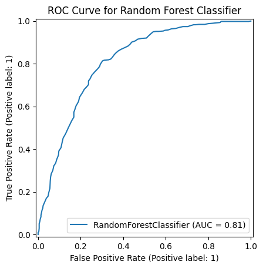
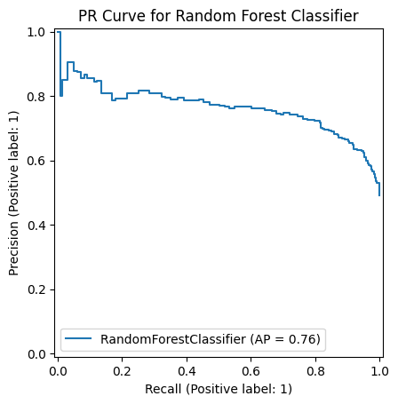
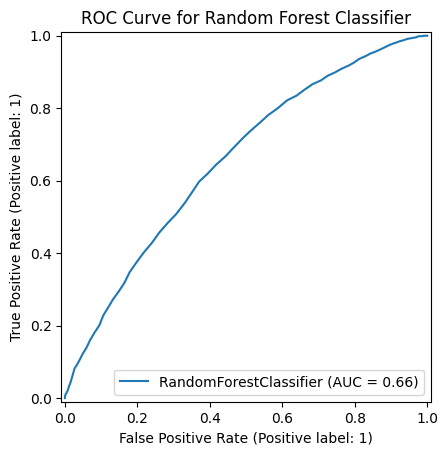
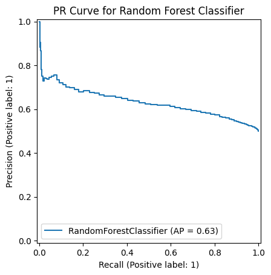
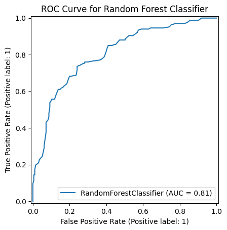
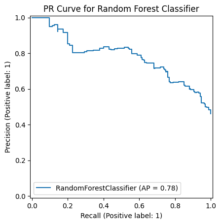
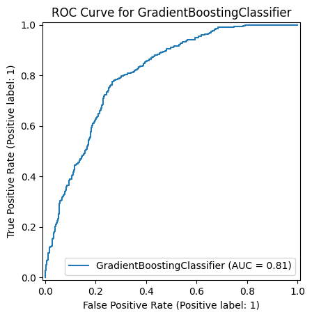
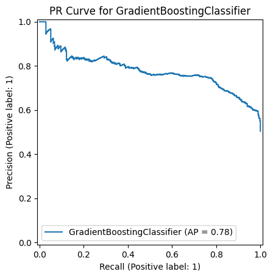

# Modeling and Feature Development
## Features
One of the biggest reasons I picked the dataset I did is for its featureset. It contains a small, but varied and useful set of features for each song, (as well as a bunch of metadata that I primarily discard). Thus, little feature engineering needed to be done in that respect. I *did* do some stuff regarding the classes I was using for classification, in picking which broader genre to try and classify. I ended up falling back onto pop, as almost exactly half of the dataset was pop and the other was not, which let me bypass the imbalance problem for evaluation and what have you. Thus making ROC and PR curves better to use. Later I decided I still didn't like that so utilized undersampling to test a few different classes, like jazz and folk, which had some rather positive results, which was interesting.
## Models
As the data is arranged in a way that avoids the issue of complex leakage (temporal, or having interconnectedness that I might miss), I was able to do a simple train test split on the data. Then, I simply ran a bunch of classifiers through the exact same evaluation gamut. I avoided simple KNN classifiers and the like, because in my analysis the data did not seem to lend itself to such methods, Instead I started with a Random Forest Classifier (and ended with it actually). Testing some other methods only seemed to lead to poorer or similar results, (the similar results were from methods similar to Random Forest, like other tree based methods). Thus I chose to stick with Random Forest as I understood it better than some of the others.

# Model Evaluation
Here are the ROC and PR curves for my random forest classifier when fed folk

pop

and jazz

You will note the significantly worse performance of the pop classifier. I think this is because, at least in this sample space, pop is actually a poorly defined class, whereas jazz, or folk, are more clearly separable, which I think is backed up by my exploratory data analysis

Just pulling things from the sklearn ensemble, i tried the Gradient Boosting Classifier, and obtained nearly identical performance results for each classifier, so similar that I could likely find a random seed to set things with that would swap the resulting graphs, around, for example, folk

