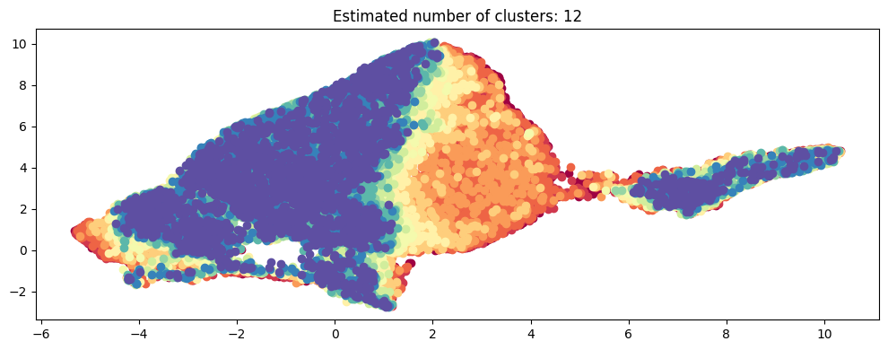
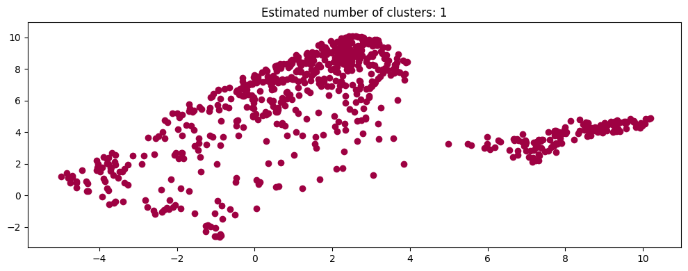
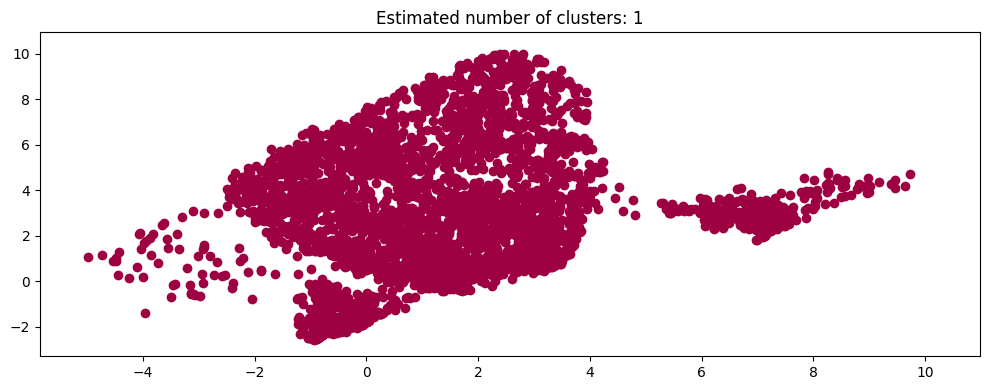
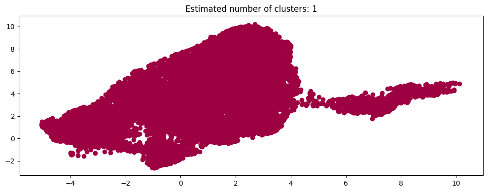

Cody Barriger

# Aural Identity and Classification of Genre
## Or why pop is generic and jazz is distinctive
What defines a genre of music? Its history, its culture, its instrumentation and the techniques used to make it, among other things. What about its sound? what defines the actual sound of a genre? A great many things likely, but to a computer, it is just numbers. With the dataset I have chosen to use, I have curated and organized data regarding the different qualities that make up over 30 thousand unique songs, as well as the genres that they are sorted into.

When I started exploring this dataset, it was pretty well organized and clean, though it had some problems. Some duplicate rows, and a lot of (for my purposes) extraneous data to chop out. After deduping I had over 34 thousand entries. I ended up cutting it down to trackid, danceability, energy, speechiness, acousticness, instrumentalness, liveness, mode, tempo, and loudness. danceability, energy, speechiness, acousticness, instrumentalness, and liveness all range from 0 to 1, but mode is a binary value, tempo is in beats per minute with generally ranges from 60 - 200 but can range out of that. loudness is negative and in decibles, this is because loudness is measured as relative to a certain maximum which is set as 0. This dataspace looked like this when exploded. 

I decided that it would be worth just taking a look at what the featurespace looked mapped into 2d, with a few filters for genre to see where they land. Here lies the first hint of my later conclusion. 

Here is that featurespace, colored by key for fun 

Here are some examples for various genres

jazz 
funk 
rock 
and last but not least

POP 

You will notive that the pop... blob, covers the entire mapped down featurespace, without any notable empty sections or anything. Compared to Jazz, or even something similarly ubiquitous, rock, this is quite the result.

I take this to suggest that, at least in the featureset I have access to in this data, pop does not have a strong unique identity, and thus also may be difficult to classify. and indeed, it did turn out to be so. So I went digging when I started creating a classifier.

I created a binary classifier in such a way that I could swap out the genre I am classifying for. Which in my implementation let me iterate over a list of the most common genres in the dataset (such that they would have enough datapoints to train a classifier on at all) and I analyzed the Precision Recall curves, ROC curves, and associated scores for each (I only did a few full curves and then just got the AUC scores for them for the bulk of the genres).

Here are the ROC and PR curves for my random forest classifier when fed folk

pop

and jazz

The Pop classifier is rather worse than the other two, as predicted, though note that the jazz one is more jagged due to a smaller amount of positive samples, (as I used undersampling to make these curves more useful). When I ran scoring over a large number of genres, I thought to find myself agreeing with which genres scored poorly and which ones well. However, Soul and Funk did poorly, while Trap was quite easily classifiable. I wouldn't ever say Soul or Funk have less audio identity than Trap, (and it has plenty to be fair), so that initial assumption, likely borne of my historical disdain for generic pop music as a whole, was not completely true. Instead, it leads me to a different conclusion.

I am led to believe, that while I can reasonably use this dataset to classify some songs into genres, and even to reccomend me songs personally, that it must be missing key features, and as it appears to be a dataset from Spotify itself, that Spotify is, or was at the time of releasing this dataset (which to be fair is rather old at this point), doing some types of music a disservice by not being able to quantify certain ways in which that music distinguishes itself from other songs. This means that this can prove as a metric with which to evaluate the featuresets spotify itself uses. Which provides an immense amount of utility to Spotify or other song streaming services, as if they can make their featuresets capture the full picture of their songs, they can make better reccomendation systems, and improve user experience.