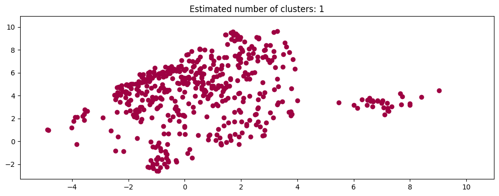

## Dataset
I will be using this [spotify songs dataset](https://www.kaggle.com/datasets/yusufadeoye/spotify-songs-dataset) I found, I think it has actually been used as an example in class. It contains a list of songs and attributes attatched to them, this includes basic stuff, like unique identifiers, artists, albums, and metadata, but it also contains some functional attributes, such as length. Then the really interesting parts show up, it has attributes such as danceability, energy, acousticness, valence (whatever that means), and some others. This is what caught my eye for using it, especially as I've struggled with featuresets, it comes with a very nice featureset, allowing me to dial in other parts of my classification methods. It also contains a feature that is a bunch of genres assigned to it.
## EDA
There are over 60 thousand entries in the dataset, however after deduping them, there are only 34 thousand, the danceability, energy, speechiness, acousticness, instrumentalness, and liveness all range from 0 to 1, but mode is a binary value, tempo is in beats per minute with generally ranges from 60 - 200 but can range out of that. loudness, is a weird one, as it is all a negative value, however it does represent the decibel volume of the song. key is just a number representing the key

In order to visualize representations and distributions, I chose to get all my initial visualizations with a seaborn pairplot 
This obviously is a little weird with the unfiltered key data in there, however does show relationships between loudness and energy, as well as weakly with other attributes. I think the most interesting thing is the relationship between danceability and tempo, as there is a very visible bump in danceablility at the 100-150 bpm range, which makes me think that tempo was part of what was used to create that feature. It makes sense, most dance songs are in that 120 bpm
## Plans and problems
I plan to use the given genre data to create a set of classifiers for a few specific genres that I will pick (eg, pop, rock, folk, funk, jazz, etc). One problem with setting this up is the genre data in the dataset, as it is a single string with a ton of genres in it, separated by spaces, (this will let me get them out, but I still need to process each set of genres into a simpler identifier). Another problem is visualization, I've played with a few dimensionality reduction methods and not found any give a visualization that captures genre clusters well. This is, I think, actually because the features are really good and can't be reduced well past this point, as they are almost completely independent, that is, I think you would be able to see clusters very clearly if you could see in 8 ish dimensions, (and probably didn't show all 30k+ songs as points at once). One thing I learned in digging into this is how soft genre classifications are, which makes sense, people make music that blends all sorts of genres all the time, so without cherrypicking the most archetypal songs for each genre, there is bound to be a rather even distribution across the featurespace.

Some examples of how genres show up in dimensionality reduction:
jazz
 
 pop
 funk
 rock.
 As you can see, there is a little bit of a discrepancy between how popular certain genres are and aren't so I will be doing a little cherrypicking of what I want to classify on, just to have enough data on either side to use. (certainly not pop, pop covers the whole range)